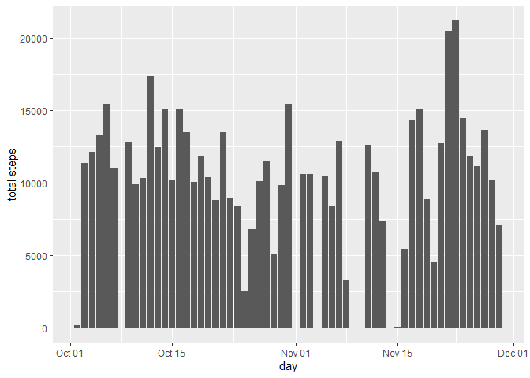
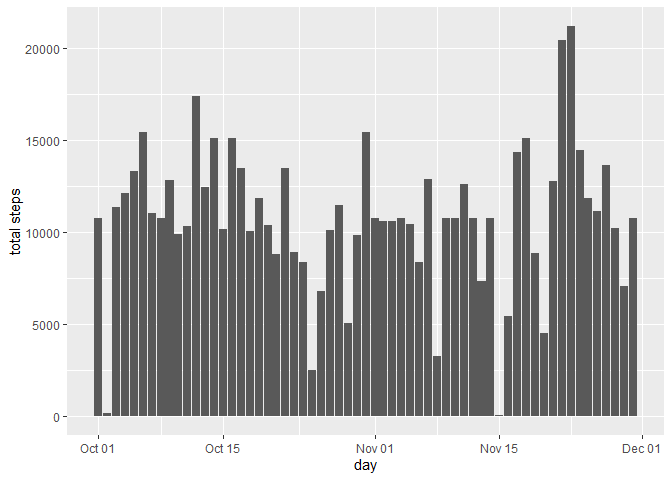
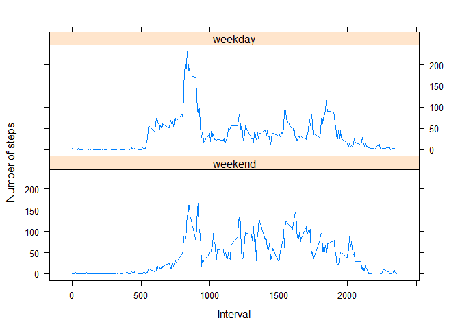

## Loading and preprocessing the data

```r
data <- read.csv(unz("activity.zip", "activity.csv"))
data <- transform(data, date = as.Date(date))
```


## What is mean total number of steps taken per day?

Define `available_data` which excludes missing values:

```r
available_data <- data[!is.na(data[1]),]
```

Define a couple of helper functions to ease our calculations later:

```r
get_steps_per_day <- function(d) {
  steps_per_day <- tapply(d$steps, d$date, sum)
  
  # steps_per_day is an array of integers with the name being the data, so convert it to a data frame
  
  steps_per_day <-
    data.frame(cbind(day = names(steps_per_day), steps = steps_per_day))
  
  rownames(steps_per_day) <- NULL
  
  steps_per_day <- transform(steps_per_day, day = as.Date(day))
  steps_per_day <- transform(steps_per_day, steps = as.numeric(as.character(steps)))
}
get_steps_per_interval <- function(d) {
  steps_per_interval <- tapply(d$steps, d$interval, mean)
  
  # average_steps_per_interval is an array of integers with the name being the data, so convert it to a data frame
  
  steps_per_interval <- 
    data.frame(cbind(interval = names(steps_per_interval), steps = steps_per_interval))
  
  rownames(steps_per_interval) <- NULL
  
  steps_per_interval <- transform(steps_per_interval, interval = as.numeric(as.character(interval)))
  steps_per_interval <- transform(steps_per_interval, steps = as.numeric(as.character(steps)))
}
```

Calculate the total steps taken per day:

```r
total_steps_per_day_with_available_data <- get_steps_per_day(available_data)
```

A histogram of total steps taken per day:

<!-- -->

Calculate the mean and median of the total steps taken per day:

```r
mean_avaialble_steps <- mean(total_steps_per_day_with_available_data$steps)
median_available_steps <- median(total_steps_per_day_with_available_data$steps)
```

The mean and median of the total steps taken per day are **10,766** and **10,765**, respectively.

## What is the average daily activity pattern?
Calculate the average steps taken per interval:


```r
average_steps_per_interval_with_available_data <- get_steps_per_interval(available_data)
```

A plot of the average steps taken per interval:
<!-- -->

Find the interval that has the maximum average steps:

```r
is_max <-
  average_steps_per_interval_with_available_data$steps ==
    max(average_steps_per_interval_with_available_data$steps)
max_per_interval <- average_steps_per_interval_with_available_data[is_max,]
interval_for_max <- max_per_interval$interval
```

The interval with the maximum average steps is **835**.

## Imputing missing values

Calcualte the total number of missing values in the databaset:

```r
total_missing_values <- sum(is.na(data$steps))
```

The total number of missing values is **2304**.

Fill in the missing values by using the average available steps for a given interval and call it `filled_data`:

```r
filled_data <- data
na_indices <- which(is.na(filled_data$steps))
ave_steps <- average_steps_per_interval_with_available_data # shorten for readability
for(i in na_indices) {
  interval <- filled_data$interval[i]
  filled_data$steps[i] <- ave_steps[ave_steps$interval ==interval,]$steps
}
```

A histogram of the total steps per day with the filled in data:
<!-- -->

Calculate the mean and medial total number of steps taken per day with the filled in data:

```r
mean_filled_steps <- mean(total_steps_per_day_with_filled_data$steps)
median_filled_steps <- median(total_steps_per_day_with_filled_data$steps)
```

The mean and remdian of the total steps taken per day with filled in data are **10,766** and **10,766**, respectively. This compares to **10,766** and **10,765** for data without missing values, which are very close. So we conclude that filling in missing values have no meaningful impact to the calculations

## Are there differences in activity patterns between weekdays and weekends?

Add a weekday / weekend factor variable to the filled data to indicate what type of day the steps were taken in:

```r
weekdays_list <- c("Monday", "Tuesday", "Wednesday", "Thursday", "Friday")
filled_data$day_of_week <- weekdays(filled_data$date)
filled_data$type_of_day <-
  factor(filled_data$day_of_week %in% weekdays_list,
         levels = c(FALSE, TRUE),
         labels = c("weekend", "weekday"))
```

A panel plot that compares steps taken during a weekend vs. a weekday:
<!-- -->
